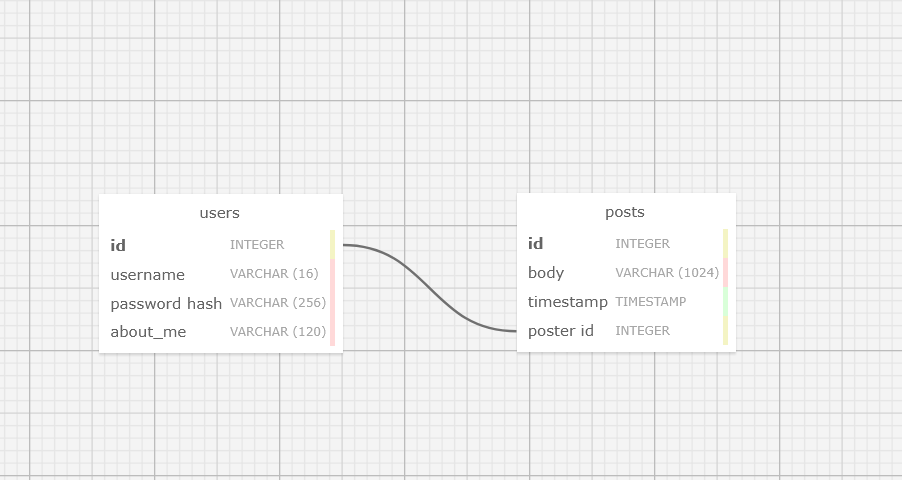

# flask-app-test-world

not vibecoded.    
I also have no idea how to link this with a json file so for now and forever this will have to run on my computer (localhost) as that's where all the db's and everything are :(.      
([Possible](https://www.jsonstorage.net/) [Json](https://jsonsilo.com/) Storage Locations -- for me in the future if I ever try to come back to this.)

I also didn't expect to get this far which is why the repository is named so badly.

---

## Setup
(Why am I making a setup when no one's actually going to use it?)

1. Download the repo into some source folder (`..../flask-app-test-world`)
(Optional) 1.5. Boot or make everything in a venv and install necessary packages
2. Run with `flask run`
3. Navigate to http://127.0.0.1:5000/ and profit.

---

## Notes

This website (if you can even see it) is based off of [this flask tutorial](https://blog.miguelgrinberg.com/post/the-flask-mega-tutorial-part-i-hello-world).

SQL Schema: 

This website was made in a day at [PAIR](https://pair.camp).           
Also, see [ourtable.xyz](https://ourtable.xyz/) for another silly little website :)
