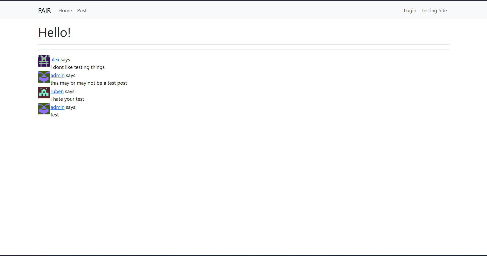
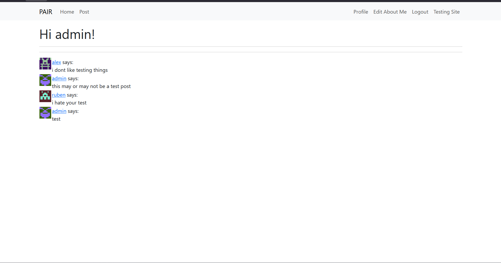
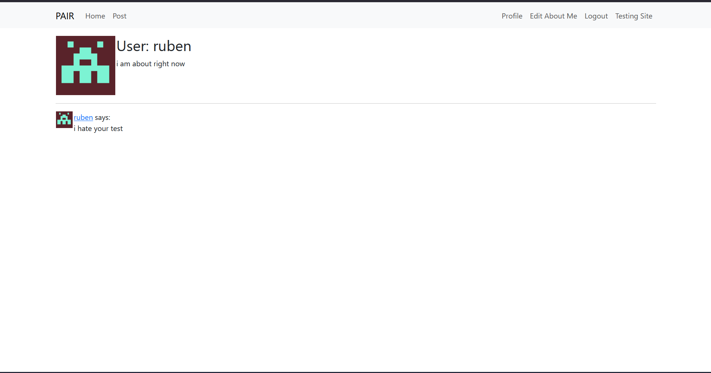

# Flask Message Board

A "simple" website implemented in Python with Flask that serves as a communal message board.

---
---

not vibecoded.    

This website was made in a day at [PAIR](https://pair.camp).           
Also, see [ourtable.xyz](https://ourtable.xyz/) for another silly little website :)

I also didn't expect to get this far which is why the repository is named so badly.

---
---

### Screenshots
Because why not.

Site index:

Site index when logged in:

Sample user profile:

---

### Setup
(Why am I making a setup when no one's actually going to use it?)

1. Download the repo into some source folder (`..../flask-app-test-world`)      
(Optional) 1.5. Boot or make everything in a venv and install necessary packages       
2. Run with `flask run`
3. Navigate to http://127.0.0.1:5000/ and profit.

---

### Notes

This website (if you can even see it) is based off of [this flask tutorial](https://blog.miguelgrinberg.com/post/the-flask-mega-tutorial-part-i-hello-world).

SQL Schema: 

In the future, I would want to implement some sorta json transfer thing where all posts are saved online as some json and navigating to the site fetches said json and displays it, so the site is kinda sorta a "static site" (well enough so that I can host it on github pages). For now though, I also have no idea how to link this with a json file so currently this website can only be run locally as that's where all the db's and everything are :(.      

For me in the future -- [Possible](https://www.jsonstorage.net/) [Json](https://jsonsilo.com/) Storage Locations
